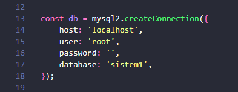
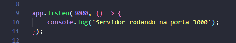

# 📦 **API Básica com Node.js, Express e MySQL2**

Este projeto é uma **API simples** desenvolvida em **Node.js** utilizando o **framework Express** e a **biblioteca mysql2** para conexão com o banco de dados MySQL.

---

## 🚀 **O que a API faz**
- O **frontend** envia requisições para a API.  
- A **API** consulta o banco de dados e retorna informações sobre os produtos.  
- Atualmente, existem duas rotas principais:
  - **`GET /produtos`** → retorna todos os produtos cadastrados no banco em formato **JSON**.  
  - **`GET /produtos/nomes`** → retorna apenas o **nome** e o **peso** dos produtos, formatados em **texto**.  

---

## 🛠️ **Tecnologias utilizadas**
- **Node.js**  
- **Express** → *framework para criação de rotas e servidor*  
- **MySQL2** → *biblioteca para conexão e execução de queries no MySQL*  

---

## 📌 **Próximos passos**
Este projeto está em constante evolução. Em breve será transformado em um **CRUD completo**, permitindo:  
- **Create** → Criar novos produtos  
- **Read** → Listar produtos  
- **Update** → Atualizar produtos existentes  
- **Delete** → Deletar produtos  

---

## ▶️ **Como executar**
# 🚀 Guia de Execução da API

1. Clone este repositório:
  git clone <url-do-repositorio>
  Baixe e instale o Node.js para o seu sistema operacional.
  Verifique a instalação no prompt de comando com:
  node -v e 
  npm -v
2. Crie um banco de dados chamado sistem1 e importe o arquivo sistem1.sql.

3. No terminal do VS Code, instale as dependências:
  npm install express
  npm install mysql2

4. Verifique se os dados de conexão ao banco (host, usuário, senha e nome do banco) estão corretos conforme sua configuração local.
  👉 

5. Confirme se a porta 3000 não está em uso. Caso esteja, altere a porta no arquivo server.js para outra disponível (ex: 4000).
  

6. Execute o servidor no terminal do vs code:

  node server.js
  caso queira alterar recomendo usar 'node --watch server.js' que a cada alteracao o 
  servidor atualizara sozinho

7.  Abra no navegador:

http://localhost:3000/produtos → retorna todos os produtos em JSON

http://localhost:3000/produtos/nomes → retorna apenas nome e peso dos produtos
